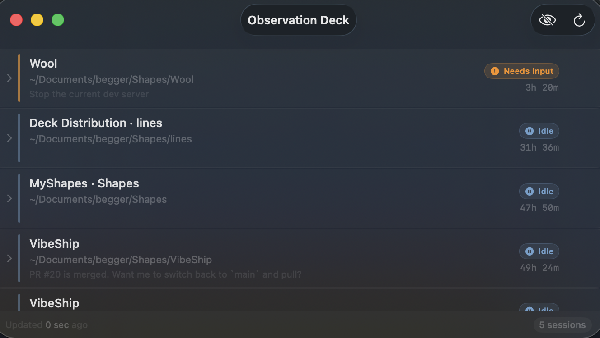
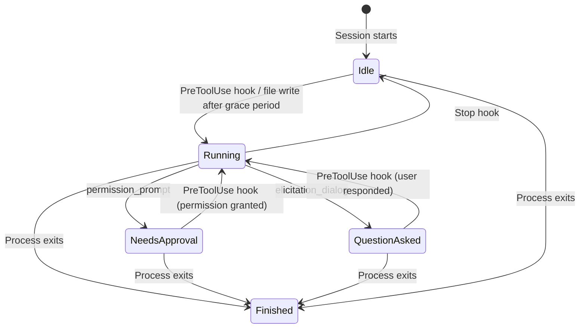

# Observation Deck

A native macOS app that monitors all running Claude Code sessions in real-time. See at a glance which sessions are working, which need your attention, and which are sitting idle — all from a non-intrusive floating window that stays on top without stealing focus or interrupting your workflow.



## Install

```bash
brew install --cask muddled-design/observation-deck/observation-deck
```

Or download the DMG from [Releases](https://github.com/muddled-design/ObservationDeck/releases).

### Upgrade

```bash
brew upgrade --cask observation-deck
```

## Features

- **Real-time status tracking** — Running, Idle, Needs Input, and Finished states powered by Claude Code's hook system for instant, accurate updates
- **Live activity display** — See what each Claude session is doing right now (e.g. "Reading SessionStore.swift", "Searching for pattern", Bash command descriptions)
- **Click to switch terminal** — Hover a session row and click the arrow icon to jump to that session's exact terminal tab (AppleScript TTY matching for Terminal.app, generic activation for iTerm/Warp)
- **Floating glass window** — Stays on top of all windows across all desktops with Apple's vibrancy design
- **Translucent mode** — Toggle between opaque and see-through window modes
- **Session names** — Displays `/rename` names alongside project directory
- **Process tree monitoring** — Expand any session to see spawned child processes
- **Subagent awareness** — Tracks activity across subagent JSONL files so status stays accurate during agent work
- **Right-click context menu** — Right-click any session to switch to its terminal

## Status States

| Status | Color | Meaning |
|--------|-------|---------|
| **Running** | Green | Claude is actively working (tool use, streaming, API calls) |
| **Needs Approval** | Orange | Claude is waiting for permission to use a tool |
| **Question Asked** | Purple | Claude asked a question via elicitation dialog |
| **Idle** | Blue | Claude finished responding, session sitting idle |
| **Finished** | Gray | The Claude Code process has exited |

## Status State Machine



- **Running is sticky** — once a hook says "running", it stays Running until a Stop or Notification hook explicitly ends it. No timeouts.
- **Needs Approval / Question Asked are sticky** — only cleared by a new hook event, not by file activity.
- **Finished** — any state transitions here when the process exits, regardless of last hook signal.

See [STATUS_TRANSITIONS.md](STATUS_TRANSITIONS.md) for detailed test cases.

## Requirements

- macOS 14 (Sonoma) or later
- Xcode 15+
- [XcodeGen](https://github.com/yonaskolb/XcodeGen) (`brew install xcodegen`)
- One or more Claude Code sessions running

## Installation

### 1. Build the app

```bash
git clone https://github.com/muddled-design/ObservationDeck.git
cd ObservationDeck
xcodegen generate
xcodebuild -project ObservationDeck.xcodeproj -scheme ClaudeMonitor -configuration Release build
```

Or open `ObservationDeck.xcodeproj` in Xcode after running `xcodegen generate`.

### 2. Configure Claude Code hooks

Observation Deck uses Claude Code's hook system to get accurate, real-time status. Add the following to your `~/.claude/settings.json`:

```json
{
  "hooks": {
    "Stop": [
      {
        "hooks": [
          {
            "type": "command",
            "command": "bash ~/.claude/monitor-hook.sh",
            "async": true
          }
        ]
      }
    ],
    "Notification": [
      {
        "hooks": [
          {
            "type": "command",
            "command": "bash ~/.claude/monitor-hook.sh",
            "async": true
          }
        ]
      }
    ],
    "PreToolUse": [
      {
        "hooks": [
          {
            "type": "command",
            "command": "bash ~/.claude/monitor-hook.sh",
            "async": true
          }
        ]
      }
    ],
    "PostToolUse": [
      {
        "hooks": [
          {
            "type": "command",
            "command": "bash ~/.claude/monitor-hook.sh",
            "async": true
          }
        ]
      }
    ],
    "SubagentStart": [
      {
        "hooks": [
          {
            "type": "command",
            "command": "bash ~/.claude/monitor-hook.sh",
            "async": true
          }
        ]
      }
    ],
    "SubagentStop": [
      {
        "hooks": [
          {
            "type": "command",
            "command": "bash ~/.claude/monitor-hook.sh",
            "async": true
          }
        ]
      }
    ]
  }
}
```

If you already have hooks configured (e.g. sound notifications), add the `monitor-hook.sh` command alongside your existing hooks.

### 3. Install the hook script

Copy the hook script to your Claude config directory:

```bash
cp monitor-hook.sh ~/.claude/monitor-hook.sh
chmod +x ~/.claude/monitor-hook.sh
```

### 4. Run

Open the built app from the Xcode build products, or build a DMG for distribution:

```bash
./scripts/build-dmg.sh
```

The app will appear as a floating window on top of all other windows. It works across all desktops/spaces.

**Toolbar controls:**
- **Eye icon** — Toggle translucent/opaque mode
- **Refresh icon** — Force an immediate refresh

**Session interactions:**
- **Click** a row to expand/collapse child processes
- **Hover** to reveal the terminal switch icon (arrow), click to jump to that tab
- **Right-click** for a context menu with "Switch to Terminal"

## How It Works

Observation Deck uses a three-layer approach for status detection:

1. **Hook signals** (primary) — Claude Code fires lifecycle hooks (`PreToolUse`, `Stop`, `Notification`, etc.) that write status to `~/.claude/monitor-status/`. This is the most accurate signal since Claude Code itself reports its state.

2. **JSONL file monitoring** (secondary) — Watches session transcript files for write events using `DispatchSource` file system watchers. Provides instant "Running" detection when Claude writes to the conversation log.

3. **CPU time sampling** (fallback) — Uses `proc_taskinfo` to detect active processing for sessions without hook data. Only used as a last resort.

The app polls every 1 second and processes file watcher events in real-time for sub-second status updates.

## Architecture

```
Sources/
├── CLibProc/                  # C wrapper for libproc.h (process monitoring)
├── ClaudeMonitor/
│   ├── ClaudeMonitorApp.swift # App entry point, floating window setup
│   ├── Models/
│   │   ├── ClaudeSession.swift
│   │   ├── ChildProcess.swift
│   │   └── SessionStatus.swift
│   ├── Services/
│   │   ├── SessionScanner.swift    # Reads ~/.claude/sessions/*.json
│   │   ├── SessionStore.swift      # Status state machine (see STATUS_TRANSITIONS.md)
│   │   ├── ProcessMonitor.swift    # PID validation, process tree, CPU time, TTY lookup
│   │   ├── FileWatcher.swift       # DispatchSource JSONL watchers
│   │   ├── HookSignalWatcher.swift # Reads hook signal files
│   │   └── TranscriptReader.swift  # Extracts current activity from JSONL transcripts
│   ├── Views/
│   │   ├── SessionListView.swift   # Session list + terminal activation
│   │   ├── SessionRowView.swift    # Row with status, activity, duration
│   │   ├── StatusBadge.swift
│   │   └── ChildProcessRow.swift
│   └── Utilities/
│       ├── PathEncoder.swift
│       └── TimeFormatter.swift
└── monitor-hook.sh            # Hook script for Claude Code
```

## Without Hooks

The app works without hooks configured, but status accuracy is reduced. Without hooks, it falls back to file modification times and CPU activity monitoring, which can't detect "thinking" periods (API calls with no local activity). Configure hooks for the best experience.

## License

MIT
